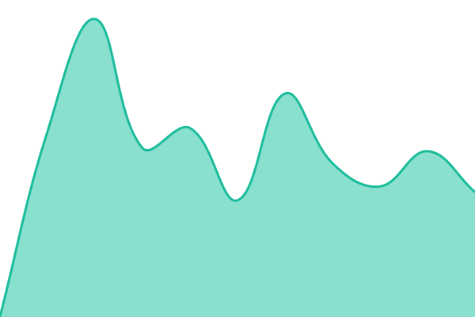

# [📈 Live Status](https://status.clavex.eu): <!--live status--> **🟩 All systems operational**

This repository contains the open-source uptime monitor and status page for [Clavex](https://clavex.eu), powered by [Upptime](https://github.com/upptime/upptime).

With [Upptime](https://upptime.js.org), you can get your own unlimited and free uptime monitor and status page, powered entirely by a GitHub repository. We use [Issues](https://github.com/clavex-eu/upptime/issues) as incident reports, [Actions](https://github.com/clavex-eu/upptime/actions) as uptime monitors, and [Pages](https://status.clavex.eu) for the status page.

<!--start: status pages-->
<!-- This summary is generated by Upptime (https://github.com/upptime/upptime) -->
<!-- Do not edit this manually, your changes will be overwritten -->
<!-- prettier-ignore -->
| URL | Status | History | Response Time | Uptime |
| --- | ------ | ------- | ------------- | ------ |
|  [Auth (id.clavex.eu)](https://id.clavex.eu/healthz) | 🟩 Up | [auth.yml](https://github.com/clavex-eu/upptime/commits/HEAD/history/auth.yml) | 

 595ms
     
 | 

<a href="https://status.clavex.eu/history/auth">100.00%</a>
    

|  [Auth Readiness (id.clavex.eu)](https://id.clavex.eu/readyz) | 🟩 Up | [auth-readyz.yml](https://github.com/clavex-eu/upptime/commits/HEAD/history/auth-readyz.yml) | 

 514ms
     
 | 

<a href="https://status.clavex.eu/history/auth-readyz">100.00%</a>
    

|  [Console (console.clavex.eu)](https://console.clavex.eu) | 🟩 Up | [console.yml](https://github.com/clavex-eu/upptime/commits/HEAD/history/console.yml) | 

 722ms
     
 | 

<a href="https://status.clavex.eu/history/console">100.00%</a>
    

|  [Docs (docs.clavex.eu)](https://docs.clavex.eu) | 🟩 Up | [docs.yml](https://github.com/clavex-eu/upptime/commits/HEAD/history/docs.yml) | 

 858ms
     
 | 

<a href="https://status.clavex.eu/history/docs">100.00%</a>
    

<!--end: status pages-->

[**Visit our status website →**](https://status.clavex.eu)

## 📄 License

- Powered by: [Upptime](https://github.com/upptime/upptime)
- Code: [MIT](./LICENSE) © [Anand Chowdhary](https://anandchowdhary.com), supported by [Pabio](https://pabio.com)
- Data in the `./history` directory: [Open Database License](https://opendatacommons.org/licenses/odbl/1-0/)
